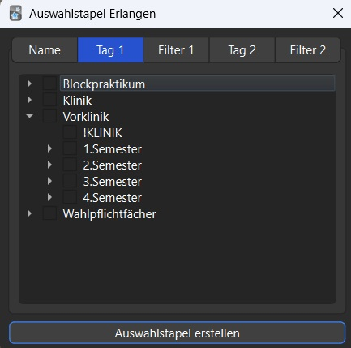
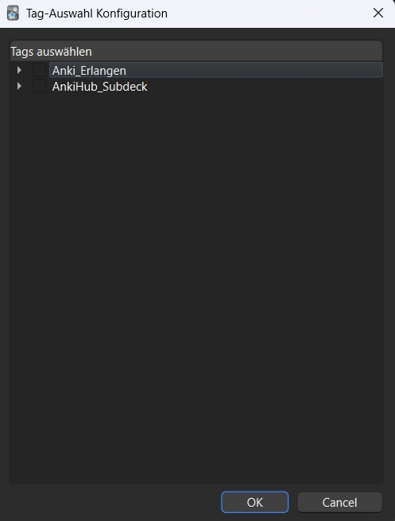

# **Auswahlstapel Erlangen**

Dieses Addon soll euch helfen schneller und einfacher Auswahlstapel passend zur lokalen Lehre in Erlangen zu erstellen!
  
 

In der Config des Addons könnt ihr die Tags (=Schlagwörter) anklicken, welche im eigentlichen Fenster gezeigt werden sollen.

  

